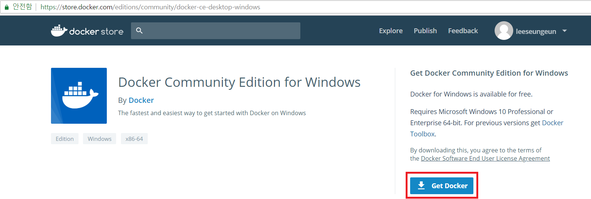
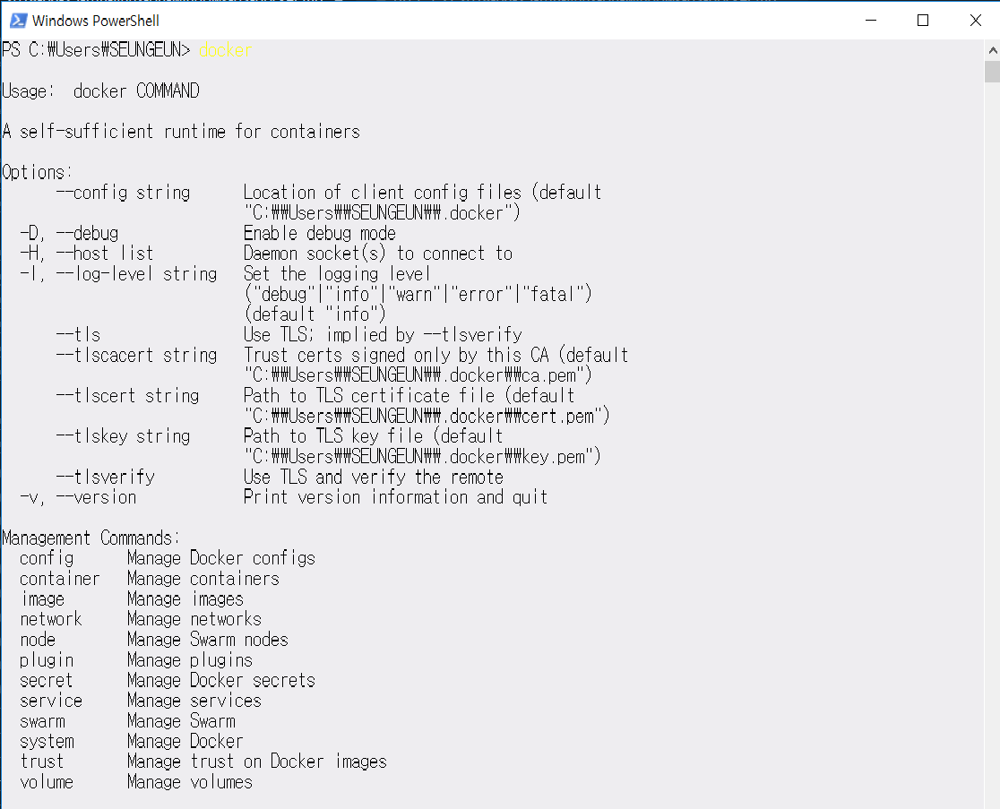
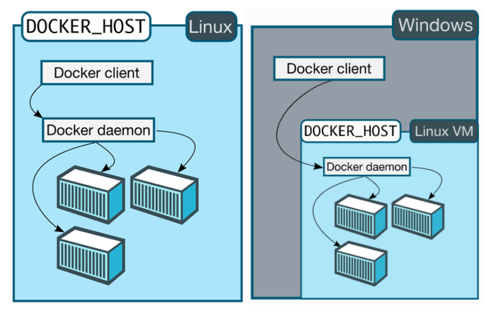
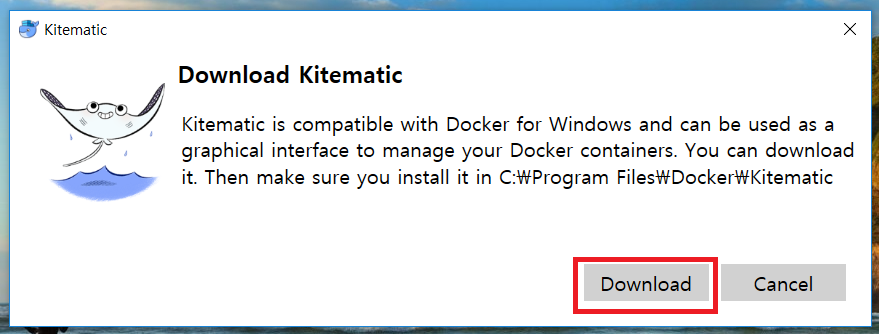

## 도커 (Docker)

운영체제 수준 가상화(Operating-system-level virtualization, 또는 Containerization)를 지원하는 컴퓨터 프로그램.[1]


운영체제 수준 가상화란, 운영체제의 커널이 두 개 이상의 격리된 사용자 공간 인스턴스를 갖출 수 있도록하는 서버 가상화 방식을 의미.[2]


이때 사용자 공간은 응용 소프트웨어와 일부 드라이버가 동작하는 메모리 영역을 뜻함.[3][4]


종합하자면, 도커는 운영체제의 커널 위에 두 개 이상의 격리된 공간에서 응용 소프트웨어 등이 동작할 수 있게 지원하는 프로그램. 


- - -

Docker v.s. Virtual Machine


가상 머신을 그림으로 표현.


그림에서 확인할 수 있듯이 가상 머신은 도커와 달리 Host 운영체제 위에 Guest 운영체제를 포함.


이에 따라 가상 머신은 도커에 비해 무겁고 느림.


([링크](http://pyrasis.com/book/DockerForTheReallyImpatient/Chapter01/01)에서 호스트 대비 도커의 성능을 확인 가능.)


- - -

도커에 대한 보다 상세한 설명은 [링크](https://subicura.com/2017/01/19/docker-guide-for-beginners-1.html)를 추천.

## 도커 설치

docker store에 접속하여 운영체제에 맞는 도커를 설치. 


이전에는 도커 설치 응용 프로그램 다운로드 시 사이트 로그인이 필요하지 않았는데, 2018년 7월 3일 즈음부터 사이트 로그인이 필요한 것으로 보임.


만일 도커 사이트 계정이 없을 경우 회원 가입 후 아래의 과정을 진행.


(참고로 도커는 무료인 Community Edition 외에 유료인 Enterprise Edition 역시 지원.)





Docker Community Edition for Windows 다운로드 예시.


도커 설치 여부를 확인하기 위해서 cmd.exe 또는 Powershell에서 ```docker```를 실행.   
(Mac의 경우 터미널에서 위의 명령 실행.)





위의 결과가 나온다면 설치 완료.


## 도커 컨테이너 실행 

도커 이미지 vs 도커 컨테이너


* 도커 이미지
    * 변경 사항을 저장하는 레이어의 집합
    * 어플리케이션을 실행하는 데 필요한 모든 것을 포함하고 있는, 실행 가능한 패키지[5] 
* 도커 컨테이너
    * 이미지의 인스턴스[6]

    
- - -

* Ubuntu


컨테이너 실행 명령어는 아래를 참고.

```
docker run -i -t -v /drive/local-directory/:/container-directory -p host-port-num:docker-port-num --link container-name:alias --name ubuntu-container-name ubuntu:tag
```

```docker run```은 새로운 컨테이너를 실행하기 위해 사용하는 명령어.


컨테이너를 시작하기 위해서는 이미지를 실행이 필요.[6]


이미지를 받기 위해서 ```docker pull image:tag``` 명령을 실행해야 하지만, ```docker run``` 명령을 실행했을 때 이미지가 없으면 자동으로 ```docker pull```명령을 실시.[7]   
(tag는 버전이라고 생각하면 편리. 최신 버전을 받고 싶다면, ```image:latest```명령어를 사용.)


명령에 사용한 옵션은 아래의 표를 참고.

옵션|설명
----|----
```--name``` | 컨테이너에 이름을 부여
```-e``` | 환경 변수 설정 (각 컨테이너 별로 설정할 수 있는 환경 변수는 [도커 허브](https://hub.docker.com)를 확인)
```-d``` | 백그라운드에서 컨테이너 실행
```-i``` | ```-t``` 옵션과 함께 사용하고 컨테이너에 어태치 (attach)되지 않을 때에도 STDIN (Standard Input, 표준 입력) 유지
```-t``` | ```-i``` 옵션과 함께 사용하고 Bash를 사용하기 위해 pseudo-TTY(터미널 에뮬레이터[8]) 지원
```-v``` | 호스트의 볼륨을 컨테이너에 마운트 (mount)
```-p``` | 도커의 포트를 호스트의 포트에 퍼블리시 (publish)
```--link``` | 실행하고자 하는 컨테이너에 다른 컨테이너를 연결


도커 컨테이너 생성을 확인하고 싶은 경우 ```docker ps -a```명령어를 cmd.exe 또는 Powershell에서 실행.


```-a```옵션을 생략하는 경우 실행 중인 컨테이너만을 표시해줌.

- - -
[이하 출처](http://web-front-end.tistory.com/79)





위의 그림에서 확인할 수 있듯이, 윈도우 위에서는 리눅스에서와 달리 리눅스 가상 머신 (Hyper-V라는 윈도우 네이티브 (native) 하이퍼바이저 이용) 위에 도커 엔진이 동작.


그 이유는 도커가 리눅스 컨테이너 (Linux Container, LXC)라는 운영체제 수준의 가상화 기술을 이용해, 리눅스 외의 운영체제에서는 리눅스 가상 머신을 필요로 하기 때문.
- - -


우분투 컨테이너의 생성이 완료되었다면, ```docker start container-name```명령어를 이용해 컨테이너를 실행.    

(```--link``` 옵션으로 연결된 컨테이너부터 실행해야 함. ```docker-compose```를 이용하면 이를 보다 쉽게 관리 가능.)


우분투 컨테이너는 ```-it``` 옵션을 사용했기 때문에 ```docker attach container-name``` 명령어를 사용하면, 우분투 컨테이너의 Bash 셸을 이용 가능.


## Docker Kitematic

Docker Kitematic을 이용하면 GUI 상으로 도커를 제어 가능.


CLI 환경이 익숙하지 않다면 Docker Kitematic의 이용을 추천.


### 설치 방법


도커 아이콘을 우클릭 해 Kitematic을 클릭한다면 아래와 같이 메시지가 나타남. 좌측에 **Download**를 클릭해 설치.





버튼을 클릭하면 ZIP 파일이 다운로드됨. 알집 등의 프로그램으로 ZIP 파일의 압축을 해제.


알집 해제 후 아래의 그림의 파일을 클릭하면, Docker Kitematic이 실행.    
Docker Kitematic에서 CLI와 동일하게 ```docker pull```부터 ```docker run```의 ```--link``` 등의 옵션도 이용 가능.


[1]: https://en.wikipedia.org/wiki/Docker_(software)
[2]: https://ko.wikipedia.org/wiki/%EC%9A%B4%EC%98%81_%EC%B2%B4%EC%A0%9C_%EC%88%98%EC%A4%80_%EA%B0%80%EC%83%81%ED%99%94
[3]: https://ko.wikipedia.org/wiki/%EC%82%AC%EC%9A%A9%EC%9E%90_%EA%B3%B5%EA%B0%84
[4]: https://en.wikipedia.org/wiki/User_space
[5]: https://docs.docker.com/get-started
[6]: https://stackoverflow.com/questions/23735149/what-is-the-difference-between-a-docker-image-and-a-container
[8]: https://unix.stackexchange.com/questions/4126/what-is-the-exact-difference-between-a-terminal-a-shell-a-tty-and-a-con
