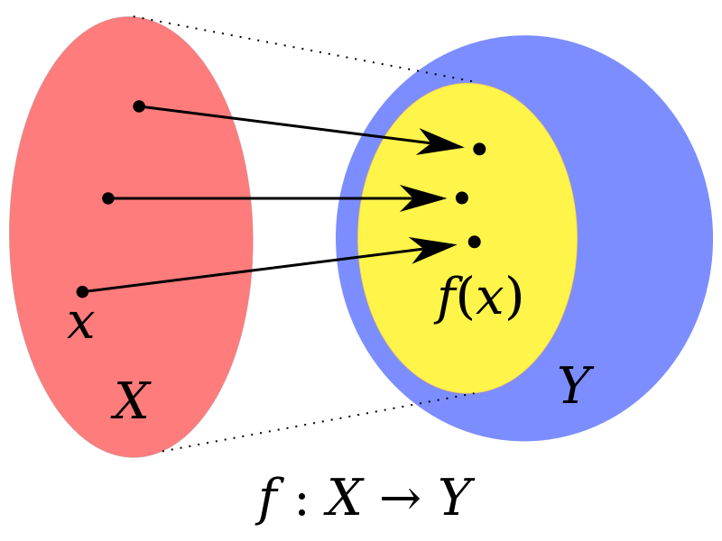

## 함수형 프로그래밍 (Functional Programming)
(이하 출처 : 
1. https://ko.wikipedia.org/wiki/%ED%95%A8%EC%88%98%ED%98%95_%ED%94%84%EB%A1%9C%EA%B7%B8%EB%9E%98%EB%B0%8D
2. https://sungjk.github.io/2017/07/17/fp.html


)
* 람다 대수 (λ-calculus, lambda-calculus)의 영향을 받아 탄생


- - -
**람다 대수 (λ-calculus, lambda-calculus)**   
(이하 출처 : 
1. https://ko.wikipedia.org/wiki/%EB%9E%8C%EB%8B%A4_%EB%8C%80%EC%88%98


)
  * 변수의 네임 바인딩과 대입의 방법을 이용해 함수 정의, 함수 적용, 귀납적 함수 추상화를 수행하고 수학 연산을 표현하는 형식 체계
  * 함수의 표현
    * 함수가 반드시 이름을 가질 필요가 없음
    * 함수의 입력 변수가 이름을 가질 필요 없음
    * 두 개 이상의 입력을 받는 함수는 하나의 입력을 받아 또다른 함수를 출력하는 함수로 다시 사용 가능
- - -

* 순수 함수 (Pure function)를 조합해 공유 상태 (shared state), 변경 가능한 데이터 (mutable data) 및 부작용 (side-effects)을 피해 소프트웨어를 만드는 프로세스
  * 순수 함수 (Pure function)
    * 수학적 함수
    * **참조 투명성 (referential transparency)**
    * 같은 입력이 주어지면 항상 같은 출력을 반환
    * 프로그램의 상태값을 바꾸는 부작용 없음 c.f. 명령형 프로그래밍

- - -
**참조 투명성 (referential transparency)**   
(이하 출처 : 
1. https://ko.wikipedia.org/wiki/%EC%B0%B8%EC%A1%B0_%ED%88%AC%EB%AA%85%EC%84%B1    
)      
 *  프로그램의 의미를 변경하지 않고 결과 값으로 함수 호출을 대체할 수 있음
 * 컴파일러와 프로그래머가 프로그램 동작을 재작성 시스템으로써 추론 가능 -> 병렬성을 수단으로 하는 코드의 최적화 가능

- - -
**수학적 함수**   
(이하 출처 : 
1. https://ko.wikipedia.org/wiki/%ED%95%A8%EC%88%98

)   
   
 * X는 집합이며 정의역이라고 함
 * Y는 집합이며 공역이라고 함
 * f(x)는 X x Y의 부분집합
 * X의 임의의 원소 x에 대해 f(x)인 Y의 y가 유일하게 존재
- - -
**명령형 프로그래밍**   
(이하 출처 : 
1. https://ko.wikipedia.org/wiki/%EB%AA%85%EB%A0%B9%ED%98%95_%ED%94%84%EB%A1%9C%EA%B7%B8%EB%9E%98%EB%B0%8D


)   
   * 선언형 프로그래밍과 반대 개념 (함수형 프로그래밍은 선언형 프로그래밍)
   * 프로그램의 상태와 상태를 변경시키는 구문의 관점에서 연산 설명
- - -
  * 공유 상태 (shared state)
    * 공유 범위 (shared scope) 내 변수, 객체 또는 메모리 공간 또는 범위 간 전댈되는 속성
    * 해당 함수가 사용하거나 영향을 미치는 모든 공유 변수 히스토리를 알아야 함
    * 함수 호출 타이밍에 종속적
  * 불변성 (Immutability)
    * 객체 생성 후 수정할 수 없는 객체
      * ```scala```의 ```val``` c.f. ```javascript```의 ```const```
  * 익명 함수 (anonymous function)
  * 고차 함수 (high order function)   
    (이하 출처 : 
    1. https://ko.wikipedia.org/wiki/%EA%B3%A0%EC%B0%A8_%ED%95%A8%EC%88%98

    )
     * 하나 이상의 함수를 인수로 가짐
     * 함수를 결과로 반환
     * 재사용성
     * 일급 객체 (First-class function)로서의 함수

- - -
**일급 객체 (First-class function)**   
(이하 출처 : 
1. https://fun-coding.org/PL&OOP4-2.html

)      
 * 함수 자체를 인자로 다른 함수에 전달, 다른 함수의 결과값으로 리턴, 함수를 변수에 할당할 수 있는 함수
- - -

* 무어의 법칙이 무너지며 병렬화 필요하나 함수형은 본질적으로 이에 적합 (https://learnbydoing.ml/2017/07/27/%EC%99%9C-%ED%95%A8%EC%88%98%ED%98%95-%ED%94%84%EB%A1%9C%EA%B7%B8%EB%9E%98%EB%B0%8D%EC%9D%84-%EC%A3%BC%EB%AA%A9%ED%95%B4%EC%95%BC-%ED%95%98%EB%8A%94%EA%B0%80/)
